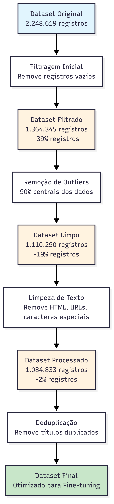
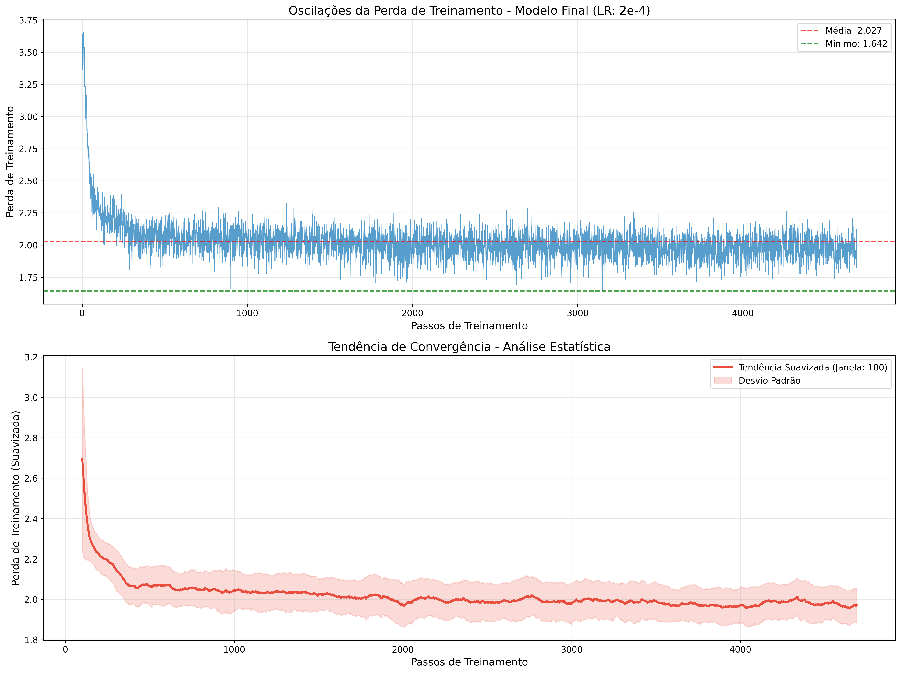
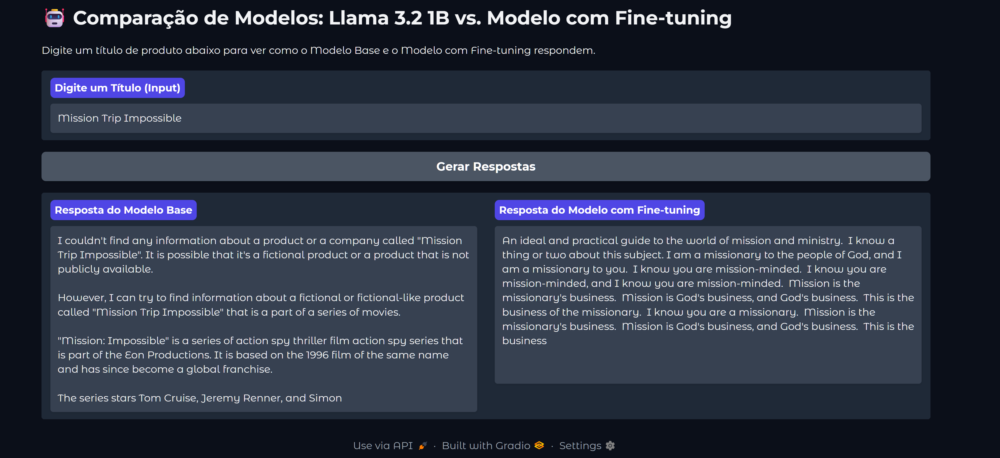

# Tech Challenge 3 - Fine-tuning of Foundation Model

## Equipe

Este projeto foi desenvolvido pelo **Grupo 49** como parte do Tech Challenge FIAP Pós-Tech fase 3:

- **Araguacy Bezerra Pereira**   - araguacybp@yahoo.com.br
- **Robson Carvalho Calixto**    - robsoncaliixto@gmail.com
- **Vinicius Fernando M. Costa** - mcostavini98@gmail.com   

## Notebooks Google Colab
[▶️ 01-descompactar_json](https://colab.research.google.com/drive/1Q7yWtcc1OI_gUipIu2wuw_zXwWleSLwE)
[▶️ 02-tratamento_dados](https://colab.research.google.com/drive/1f4tpRogCIDzEeOlF7WCrGBITCYRDWbI5)
[▶️ 03-Amostra](https://colab.research.google.com/drive/1kGnvSIKUCaD4pG1X4ngoWbeqLr59K1ji)
[▶️ Fine-tuning](https://colab.research.google.com/drive/12bzWxEa5uoMFC53OYY-wsjJfai9gBiNf#scrollTo=XSG8SqCkMbE7)

## Sumário

- [Introdução](#introdução)
- [Estrutura dos Notebooks](#estrutura-dos-notebooks)
  - [Notebook 1: Descompactação e Extração](#notebook-1-descompactação-e-extração-01_descompactar_jsonipynb)
  - [Notebook 2: Tratamento e Limpeza](#notebook-2-tratamento-e-limpeza-02_tratamento_dadosipynb)
  - [Notebook 3: Amostragem e Formatação](#notebook-3-amostragem-e-formatação-03_amostraipynb)
  - [Notebook 4: Fine-tuning](#notebook-4-fine-tuning-tech_challenge_3_finetuningipynb)
  - [Pipeline de Processamento](#pipeline-de-processamento)
- [Escolha do Modelo e Template de Fine-tuning](#escolha-do-modelo-e-template-de-fine-tuning)
- [Processo de Fine-Tuning](#processo-de-fine-tuning)
  - [Parâmetros Críticos de Otimização](#parâmetros-críticos-de-otimização)
  - [Evolução do Loss ao longo do treinamento](#evolução-do-loss-ao-longo-do-treinamento)
  - [Métricas de Treinamento](#métricas-de-treinamento)
  - [Comparação entre o modelo original e o modelo fine-tuned](#comparação-entre-o-modelo-original-e-o-modelo-fine-tuned)
  - [Resultados e Discussão](#resultados-e-discussão)
- [Conclusão](#conclusão)
  - [Modelo Final](#modelo-final)
- [Referências](#referências)

## Introdução

O objetivo do trabalho será em explorar o processo de fine-tuning de um foundation model, com o objetivo de gerar descrições de produtos da Amazon. A metodologia aplicada foi utilizando a biblioteca Unsloth, uma biblioteca especializada no treinamento de LLMs, e um dataset composto por títulos e descrições de produtos da Amazon. O projeto demonstra a viabilidade de especializar um modelo de linguagem para uma tarefa específica, mesmo com recursos computacionais limitados, como os oferecidos pelo Google Colab na versão gratuita.

O desafio central do projeto reside na manipulação de um grande volume de dados e na otimização do processo de treinamento para alcançar resultados satisfatórios. A escolha do modelo, a preparação do dataset e a definição dos hiperparâmetros de treinamento foram etapas cruciais para o sucesso do fine-tuning, e serão detalhadas ao longo deste documento.

## Estrutura dos Notebooks

O projeto foi organizado em quatro notebooks principais que implementam um pipeline sequencial, garantindo a execução separadamente. Esta estruturação modular permite a reprodução do experimento e facilita a compreensão do processo de fine-tuning.

### Notebook 1: Descompactação e Extração (`01_descompactar_json.ipynb`)

O primeiro notebook é responsável pelo processamento inicial do dataset `The AmazonTitles-1.3MM`, que contém mais de 2 milhões de registros. Nesta etapa, os dados são descompactados e submetidos a uma filtragem inicial para remover registros com títulos ou conteúdos vazios, bem como registros com títulos excessivamente curtos. Após a extração e limpeza preliminar, os dados são salvos em formato Parquet para otimização do processamento nas etapas subsequentes.

### Notebook 2: Tratamento e Limpeza (`02_tratamento_dados.ipynb`)

Este notebook implementa um processo de limpeza textual, removendo elementos que poderiam prejudicar o treinamento do modelo. As operações incluem a remoção de tags HTML, URLs e endereços de e-mail, além da eliminação de caracteres especiais, mantendo apenas o alfabeto inglês. Termos considerados inúteis (boilerplate) também são removidos nesta etapa, garantindo que apenas conteúdo relevante seja utilizado no treinamento.

### Notebook 3: Amostragem e Formatação (`03_amostra.ipynb`)

Devido às limitações de hardware do Google Colab, foi necessário realizar uma amostragem estratificada do dataset. Inicialmente, o dataset foi preparado para conter uma amostragem de 100 mil registros aleatórios, posteriormente reduzida para 50 mil registros. Nesta etapa, os dados são convertidos para o template Alpaca, que estrutura as informações em um formato de instrução, entrada e resposta, facilitando o aprendizado do modelo durante o fine-tuning.

### Notebook 4: Fine-tuning (`tech_challenge_3_finetuning.ipynb`)

O notebook final implementa o processo de fine-tuning propriamente dito, carregando o modelo unsloth/Llama-3.2-1B-Instruct e aplicando as configurações de treinamento otimizadas. Este notebook inclui também funcionalidades para análise dos resultados após o fine-tuning, permitindo a avaliação da performance do modelo treinado. Os detalhes sobre os hiperparâmetros utilizados e as considerações técnicas específicas estão documentados neste notebook.

### Pipeline de Processamento

## Escolha do Modelo e Template de Fine-tuning

O modelo base selecionado foi o unsloth/Llama-3.2-1B-Instruct, uma versão do Llama 3.2 com 1 bilhão de parâmetros, otimizada pela Unsloth para fine-tuning. A escolha por um modelo "Instruct" se deu por sua predisposição ao treinamento com formatos de chat específicos, o que facilita o processo de aprendizado do modelo. A biblioteca Unsloth foi usada por sua capacidade de acelerar o treinamento em até 4 vezes em comparação com o LoRA tradicional, através da técnica QLoRA (Quantized Low-Rank Adaptation).

Durante a fase experimental, observou-se que o modelo não aprendia eficientemente apenas com os dados brutos. Para solucionar isso, foi adotado o template Alpaca, que estrutura os dados de entrada em um formato de instrução, pergunta e resposta, facilitando a compreensão do modelo sobre a tarefa a ser executada.

Usando o template Alpaca, foi possível obter uma taxa de training loss de 2.05 e o resultado observável foi que o modelo ainda apresentava uma baixa taxa de aprendizado quando realizada a primeira iteração. 
Com isso a estratégia seguinte foi aplicar uma formatação de chat, o modelo unsloth Instruct já foi treinado com um formato de chat específico. 

Ao impor uma estrutura como alpaca, o modelo foi forçadoa aprender um novo template de formatação do zero, em vez de apenas preencher os campos do template que ele já conhece. Com isso o modelo começou apresentar convergência Anêmica, o loss começou na faixa de 3.0 a 3.4 e, após mais de 2.500 passos (cerca de 1.62 épocas), o valor ficou estagnado em uma faixa entre 1.9 e 2.3. Embora o valor mais baixo alcançado tenha sido 1.78 , a tendência geral foi que o loss oscilou a cima de 2.50, o que é muito alto para um fine-tuning bem-sucedido de SFT.

 

Os resultados do gráfico confirmam a convergência anêmica do modelo apontada anteriormente. Mesmo o melhor resultado (LR 2e-5) ainda apresenta loss final acima de 2.0, o que é considerado alto para um fine-tuning de SFT bem-sucedido. Isso valida a hipótese de que forçar o modelo Llama-3.2-1B-Instruct a aprender um novo template (Alpaca) interferiu em sua capacidade de convergência, já que o modelo já possuía um formato de chat pré-treinado específico.

As execuções demonstram que learning rates menores (2e-5) proporcionam maior estabilidade, mesmo que não alcancem os menores valores absolutos de loss durante o treinamento.

## Processo de Fine-Tuning

O fine-tuning foi executado utilizando a técnica QLoRA com quantização de 4-bits, uma abordagem que reduz significativamente o consumo de memória sem grande perda de performance. Os hiperparâmetros de treinamento foram definidos com base nas recomendações da documentação da Unsloth e em experimentação, conforme detalhado na etapa de escolha do template para o fine-tuning.

### Parâmetros Críticos de Otimização

| Categoria | Parâmetro | Valor Otimizado | Justificativa  |
| :--- | :--- | :--- | :--- |
| **Aprendizado (LR)** | `learning_rate` | $3e-5$ | Ponto de equilíbrio entre o LR de $5e-5$ (muito volátil) e $1e-5$ (muito lento). |
| **Tempo de Treinamento**| `num_train_epochs` | 3 | Aumentado de 3 para garantir tempo de convergência suficiente com um LR mais baixo. |
| **Estabilidade Inicial**| `warmup_steps` | 10 | Aumentado de 10 para suavizar o início do treinamento e amortecer o impacto do novo LR. |
| **Capacidade LoRA** | `LoRA r` / `alpha` | 32 / 64 | Aumentado de $16/16$ para permitir que o adaptador LoRA capture padrões mais complexos no dataset. |
| **Eficiência** | `packing` | `True` | Crucial para maximizar a utilização da GPU (A100) e a velocidade de treinamento (Token Efficiency). |
| **Batch Efetivo** | `per_device_train_batch_size` | 16 | Maximizado para uso da VRAM da A100. |
| **Batch Efetivo** | `gradient_accumulation_steps` | 2 | Ajustado para manter o Batch Efetivo em 32. |
| **Scheduler** | `lr_scheduler_type` | `'cosine'` | Preferido para treinamento estável, garantindo que o LR decaia suavemente. |
| **Otimizador** | `optim` | `"paged_adamw_8bit"` | Essencial para o gerenciamento eficiente de memória na A100 usando Unsloth. |
| **Contexto** | `max_seq_length` | 2048 | Mantido alto para permitir contextos de diálogo longos sem truncamento. |

### Evolução do Loss ao longo do treinamento

O gráfico abaixo ilustra a evolução do Loss ao longo do treinamento, mostrando a taxa de aprendizado de 3e-5 e o número de épocas de 3.

O fine-tuning alcançou a eficiência máxima na A100, mas o valor final do Loss em 2.0267 indica que o modelo esbarrou no limite de aprendizado de dados em apenas 3 épocas. A calibração dos parâmetros ajustou o learning_rate para um ponto ideal (3e−5), eliminando a volatilidade, mas a pouca quantidade de passos não foi suficiente para quebrar a barreira de Loss de 2.0. Isso sugere que o obstáculo final não é mais a configuração da GPU ou o modelo (que converge lentamente), mas sim a qualidade intrínseca e a ambiguidade do dataset.

### Métricas de Treinamento

A tabela abaixo resume as principais métricas de treinamento, extraídas dos logs de execução do treinamento. É possível observar que o treinamento foi concluído com sucesso, com uma perda de treinamento final de 2.0267 e uma taxa de aprendizado de 3e-4 que é um forte indicador de que o problema final reside na baixa qualidade dos dados, que é um limite físico que a otimização de hiperparâmetros não consegue quebrar.

| Métrica | Valor | Unidade/Tipo | Descrição |
| :--- | :--- | :--- | :--- |
| **`global_step`** | 4689 | Passos | Número total de passos de otimização concluídos. |
| **`training_loss`** | 2.0267 | Float | O valor final da Loss de treinamento (média de todos os passos). |
| **`epoch`** | 3.0 | Épocas | Número de épocas completadas. |
| **`train_runtime`** | 6205.69 | Segundos | Tempo total que o treinamento levou. |
| **`train_samples_per_second`**| 24.171 | Amostras/segundo | Velocidade média de processamento de amostras. |
| **`train_steps_per_second`** | 0.756 | Passos/segundo | Velocidade média de passos de otimização. |
| **`total_flos`** | $6.74 \times 10^{17}$ | FLOPs | Total de operações de ponto flutuante realizadas. |

### Comparação entre o modelo original e o modelo fine-tuned
Comparação entre os modelos usando a biblioteca python gradio para comparar os dois modelos com a mesma entrada. É possível observar que o modelo fine-tuned apresenta uma resposta contendo mais informações e que é mais precisa do que o modelo original.

### Resultados e Discussão

O processo de fine-tuning apresentou desafios significativos, principalmente relacionados à convergência do modelo e à otimização do template de treinamento. As métricas de treinamento, extraídas dos logs de execução, fornecem um panorama claro da evolução do aprendizado do modelo.

Inicialmente, ao treinar o modelo sem um template estruturado, a perda de treinamento (training loss) manteve-se em um patamar elevado, com o valor mais baixo sendo de 2.75. Este resultado indicava que o modelo não estava conseguindo aprender a tarefa de geração de descrição a partir dos dados brutos, resultando em respostas com alto grau de alucinação.

A introdução do template Alpaca representou uma melhora, com a perda de treinamento caindo para 2.05. No entanto, o modelo ainda exibia uma baixa taxa de aprendizado. A análise dos logs de treinamento, revelou uma convergência anêmica. O loss iniciava na faixa de 3.0 a 3.4 e, após um número considerável de passos, estagnava em uma faixa entre 1.9 e 2.3. Embora picos de melhora tenham sido observados, com o loss atingindo um mínimo de 1.78, a tendência geral indicava uma oscilação alta. 

Essa dificuldade foi atribuída ao fato de que o modelo unsloth/Llama-3.2-1B-Instruct já possui um formato de chat pré-treinado. Ao impor um novo template como o Alpaca, o modelo foi forçado a aprender uma nova estrutura do zero, em vez de apenas preencher os campos de um formato que já lhe era familiar. Apesar dos desafios, o modelo final, robsoncalixto/Llama-3.2-1B-finetuning-grp49, foi disponibilizado no Hugging Face Hub em formato GGUF, compatível com ferramentas como Ollama, permitindo sua utilização e avaliação em cenários práticos.

## Conclusão

Este trabalho demonstrou um ciclo completo de fine-tuning de um modelo de linguagem, desde a preparação de um grande volume de dados até a disponibilização de um modelo especializado. O uso da biblioteca Unsloth e da técnica QLoRA provou ser uma abordagem eficaz para lidar com as restrições de hardware, permitindo o treinamento de um LLM em um ambiente como o Google Colab.

Os resultados indicam que a escolha do template de treinamento é um fator crítico para o sucesso do fine-tuning, especialmente ao utilizar modelos pré-treinados com formatos de chat específicos. A dificuldade em alcançar uma perda de treinamento ideal evidencia a complexidade do processo e a necessidade de experimentação contínua para otimizar os resultados.

Apesar dos desafios, o projeto alcançou seu objetivo principal de especializar um modelo de linguagem para a geração de descrições de produtos, disponibilizando um artefato funcional que pode ser utilizado e aprimorado em trabalhos futuros. A experiência adquirida neste trabalho reforça a importância de uma metodologia estruturada e da compreensão aprofundada das ferramentas e técnicas de fine-tuning para o desenvolvimento de soluções de inteligência artificial aplicadas a problemas de negócio específicos do mundo real.

### Modelo Final
- **Hugging Face Hub**: [robsoncalixto/Llama-3.2-1B-finetuning-grp49](https://huggingface.co/robsoncalixto/Llama-3.2-1B-finetuning-grp49)
- **Formato**: GGUF (compatível com Ollama)

## Referências

- [Unsloth Documentation](https://docs.unsloth.ai/)
- [LM Studio](https://lmstudio.ai/)
- [Hugging Face Transformers](https://huggingface.co/docs/transformers)
- [QLoRA: Efficient Finetuning of Quantized LLMs](https://arxiv.org/abs/2305.14314)
- [Alura: Fine-tuning com o Llama-3](https://cursos.alura.com.br/course/unsloth-domine-fine-tuning-poder-llama-3)
- [Gradio Documentation](https://www.gradio.app/docs)
- [Guia de Quantização de Modelos IA do Hugging Face](https://www.linkedin.com/pulse/tutorial-guia-de-quantiza%C3%A7%C3%A3o-modelos-ia-do-hugging-face-carraro-crtzf/?trackingId=lUEyIA5uoh35DsR2lGUeIA%3D%3D)
- [PyTorch Documentation](https://docs.pytorch.org/torchtune/0.2/tutorials/chat.html)
- [Llama Documentation](https://www.llama.com/docs/model-cards-and-prompt-formats/llama3_1/)

---

**Nota**: Este projeto demonstra um pipeline completo de fine-tuning, desde o processamento de dados até a disponibilização do modelo treinado.
